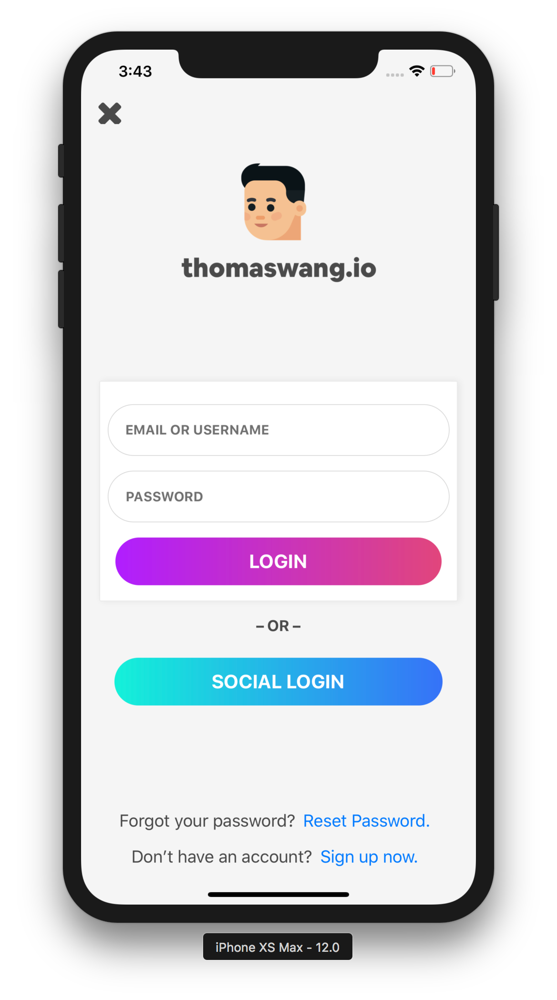
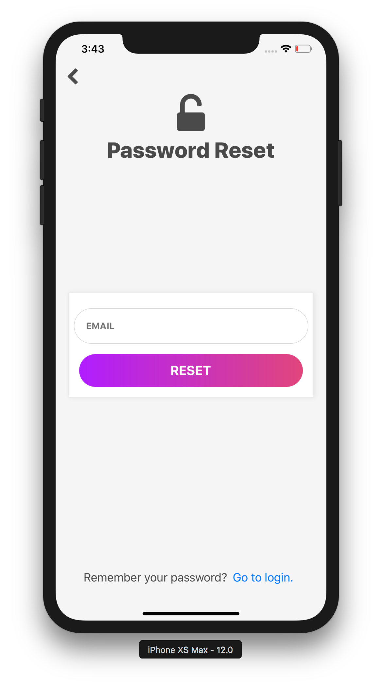
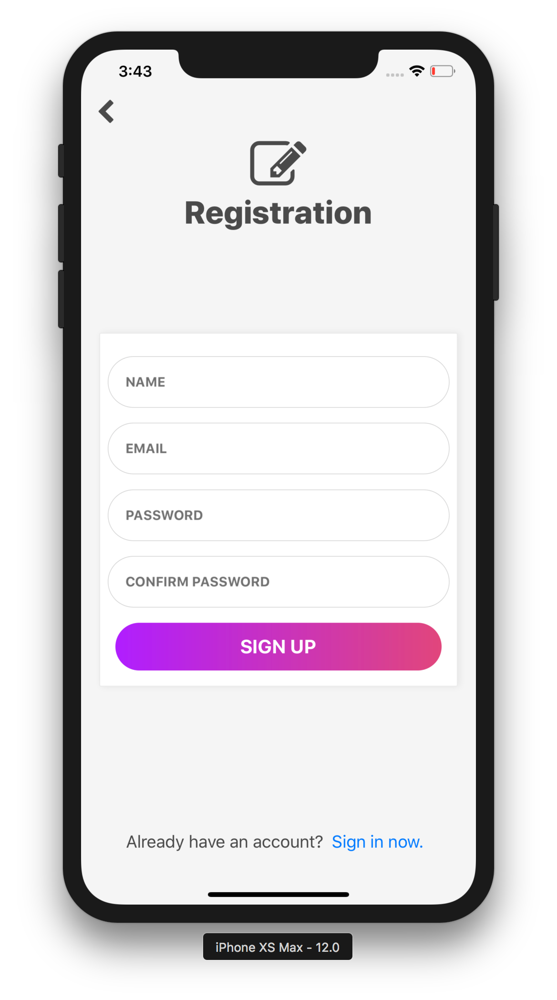
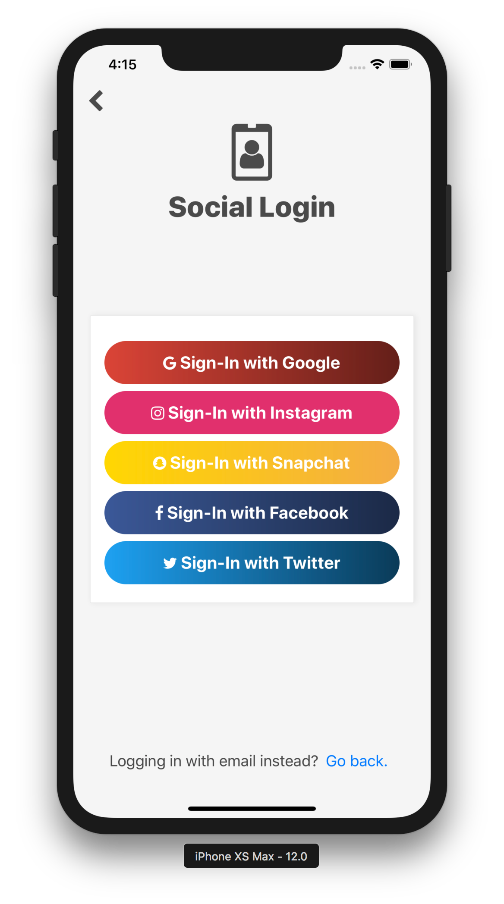

# React Native Auth Screens [](https://twitter.com/intent/tweet?text=Check%20out%20these%20sweet%20login,%20registration,%20and%20reset%20screens%20by%20@thomaswangio%20for%20@reactnative%20&url=https://github.com/thomaswangio/auth-screens)

An authentication screen template for React Native showcasing [React Native Gradient Buttons](https://github.com/thomaswangio/react-native-gradient-buttons).

## Installation and Usage

```
$ git clone https://github.com/thomaswangio/auth-screens.git
$ cd auth-screens
$ yarn
$ expo start
```

## Screenshots






Feel Free to use and customize for your apps! 😊

*License: [MIT](https://github.com/thomaswangio/auth-screens/edit/master/LICENSE.md)*
